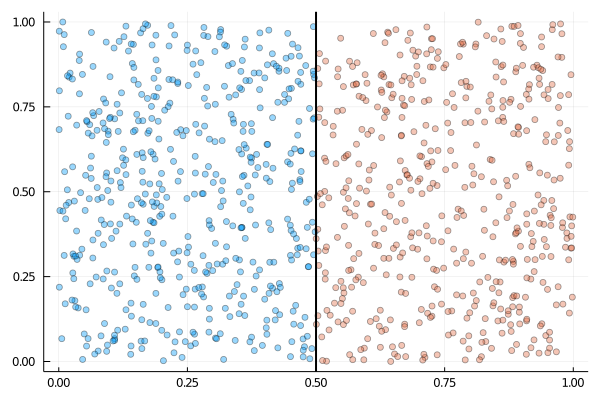
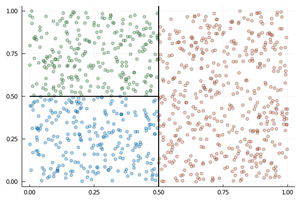

# Recursive Partitioning

The `RecursivePartition` module allows the user to partition data into
(hyper-)rectangular subsets across a bounded space. I will start with a
simple motivating example which demonstrates the partitioning functionality of
this module. Suppose that you have a dataset containing ``1000`` pairs of
coordinates which exist between ``0`` and ``1`` i.e. all of the points are
positioned somewhere within the unit square. This information
can be encoded using a matrix, where the ``i``'th row details the upper/lower
bounds of the ``i``'th coordinate. Our square is therefore represented by the
matrix

```math
\begin{pmatrix}
  0 & 1 \\
  0 & 1 \\
\end{pmatrix}.
```

One way to approach dividing up this space is to simply split the square in half
and determine which side each of the points falls on. Assuming we are splitting
in dimension ``1`` (or the ``x``-direction in terms of coordinates), this would
look something like this:



We can now represent this as a vector of matrices, each matrix corresponding to
a separate subregion.

```math
P = \left[
\begin{pmatrix}
  0 & 0.5 \\
  0 & 1
\end{pmatrix},
\begin{pmatrix}
  0.5 & 0 \\
  0   & 1
\end{pmatrix}
\right]
```

We can continue to recursively partition the resulting subsets into smaller
rectangles e.g.



Partitions defined in this way can be constructed using
[`RecursivePartition.insert_knot`](@ref).

```julia
using RecursivePartition

X = rand(1000, 2)
P = [repeat([0.0 1.0], 2, 1)]
P = insert_knot(P, 1, 1, 0.5) # Split in dimension 1.
P = insert_knot(P, 1, 2, 0.5) # Split subregion 1 in dimension 2.
Xsubsets = partition(X, P) # Partition X according to P.
```

The output `Xsubsets` is a vector of matrices; each matrix contains the rows
of `X` pertaining to a particular subset. Although it is convenient to visualize
this process in 2D, it is easily extended to higher dimensions.

## Functions

```@autodocs
Modules = [RecursivePartition]
Pages = ["partition.jl"]
```
