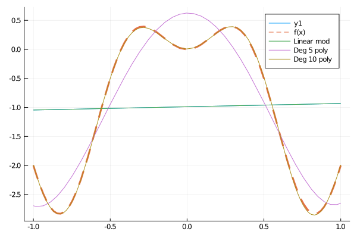
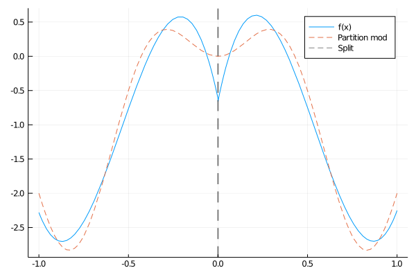
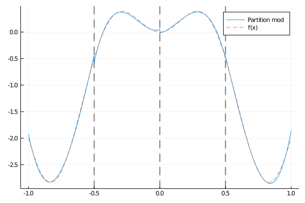

# Regression

The objective of regression is to model the relationship between a set of
predictor and response variables. Once trained, the regression model can be used
to predict the response variable, given a new predictor variable.
RecursivePartition implements a variety of regression models, however its
most notable feature is the [`PartitionModel`](@ref) type. This model is
fitted by partitioning the space of predictor variables
(see [Recursive Partitioning](@ref) for a visualization of this process) and fitting
a flexible model within each subregion. One can think of this as a
*divide and conquer* approach to learning complex relationships between
predictors and responses.

Standard linear models will first be introduced, primarily motivating the use
of the [Polynomial Chaos Basis](@ref) expansion as a method for incorporating
a non-linear structure into regression models. The [Partitioned Models](@ref)
tutorial then shows how we can aggregate the linear models across a partitioned
space.

Note that the examples in this tutorial are at most 2-dimensional for
visualization purposes. However, usage is identical for higher dimensional
data.

## Bayesian Linear Models

All the Bayesian linear models implemented in RecursivePartition currently
assume that the predictor variables are Normally distributed with a mean
given by some unknown function i.e.

```math
y = f(\boldsymbol{x}) + ϵ, \quad ϵ \sim \mathcal{N}(0, σ^2)
```

For this tutorial we choose an arbitrarily choose the mean function

```math
f(x) = 2 x \text{sin}(2 π x) - 2 x^2
```

and generate a random data set.

```julia
using RecursivePartition, Plots, Random

Random.seed!(100) # Set seed for reproducability

N = 10000
SD = 0.5
f(x) = 2 * sin(2 * π * x[1]) * x[1] - 2 * x[1]^2
x, y = gendat(N, SD, f, 1; bounds=[-1.0, 1.0])

plot(x, y, seriestype=:scatter, alpha=0.1, label="data")
plot!(f, xlims=[-1.0, 1.0], lw=2, lty=2, s=:dash, label="f(x)")
```

The figure below shows the plot outputted by the above code.


Our job us thus to use the noisy blue data points to approximated the
true mean of the data (given by the dashed red line). It is important to
remember that the mean function ``f`` is used only to generate the data; it is
unknown to the regression models.

In this tutorial we will fit three different Bayesian models to the dataset shown
in the figure above.

* A linear model.
* An order 5 polynomial regression.
* An order 10 polynomial regression.

In a polynomial regression we take the original predictor variables
and transform them using a polynomial basis (see [Polynomial Chaos Basis](@ref)).
Simply put, we are constructing the "best" polynomial which approximates ``f``.

```julia
# Fit a linear model
linearmod = BayesLinearModel(x, y)
linfun = predfun(linearmod)

# For plotting purposes, we need a function which accepts a float, not an
# array...
linfun_flat(x) = linfun([x])

# Fit an order 5 and 10 polynomial model
polymod5 = PolyBLM(x, y, 5, [-1.0, 1.0])
polymod10 = PolyBLM(x, y, 10, [-1.0, 1.0])
polyfun5 = predfun(polymod5)
polyfun10 = predfun(polymod10)
polyfun5_flat(x) = polyfun5([x])
polyfun10_flat(x) = polyfun10([x])

# Create plot
plot(linfun1, xlims=[-1.0, 1.0])
plot!(f, xlims=[-1.0, 1.0], label="f(x)", lw=3, s=:dash)
plot!(linfun_flat, xlims=[-1.0, 1.0], label="Linear mod")
plot!(polyfun5_flat, xlims=[-1.0, 1.0], label="Deg 5 poly")
plot!(polyfun10_flat, xlims=[-1.0, 1.0], label="Deg 10 poly")
```

In the above code, [`predfun`] outputs a function which accepts a vector
argument. This function takes a predictor and ouputs the predicted response
according to the model. The figure below shows the plot outputted using this
code.



Firstly we note that (unsurprisingly) the linear model performs very poorly here.
This is because using [`BayesLinearModel`](@ref) restricts our model to a
(linear) straight line, however the structure of the data is clearly non-linear.
The order 5 polynomial model does a reasonable job of approximating ``f``,
however our model is still not flexible enough. Once we increase the order
(and hence the complexity of the model) to 10, we finally have a model which
accurately approximates ``f``.

With the model trained, we can predict response variables as follows.

```julia
Xtest, ytest = gendat(N, SD, f, 1; bounds=[-1.0, 1.0])
ytest_approx = predict(polymod10, Xtest)
```

## Partitioned Models

Although the polynomial regression models above may seem appealing, they
quickly become impractical as the dimension of the predictor variables
(and the degree of the model) increases. As an alternative approach, we can
partition the space into separate regions and fit low order polynomial
model within each one. For example, the following code will divide the data
in half at 0, then fit an order 3 polynomial regression inside each half.

```julia
# Construct partition
P = [[-1.0 1.0]] # Define the whole space (x lies between -1 and 1).
insert_knot!(P, 1, 1, 0.0) # Split in the middle.

# Fit partitioned polynomial models
partition_model = partition_polyblm(x, y, P; degmax=3)
```

We no longer provide code for producing figures, as the process is essentially
the same. The figure below should the partitioned approximation



This approximation isn't terrible, but the natural response is to wonder
whether we should partition the space further. In higher dimensional settings
we don't have the luxury of plotting the function and choosing a sensible
partition. Luckily, RecursivePartition implements a novel algorithm for
dividing up the space automatically.

```julia
automod = auto_partition_polyblm(x, y, [-1.0, 1.0])
```

which outputs the following model.



The automatic partitioning algorithm has determined that each sub-region benefits
from one more split. Currently the automatic partitioning algorithm is only
capable of splitting in the center of a sub-region.

This simple example is merely to demonstrate the rationale behind these
recursively partitioned regression models. The true benefit of these models
comes when we move to higher dimensional settings. Using automatic
partitioning, we can adapt to the complexity of the data, removing the
need to tune the complexity of the model manually. Partitioned models are a
type of non-parametric model, meaning they are used when little is known
about the structure of the data, and hence a highly flexible model is required.

## Functions

```@autodocs
Modules = [RecursivePartition]
Pages = ["regression.jl"]
```
